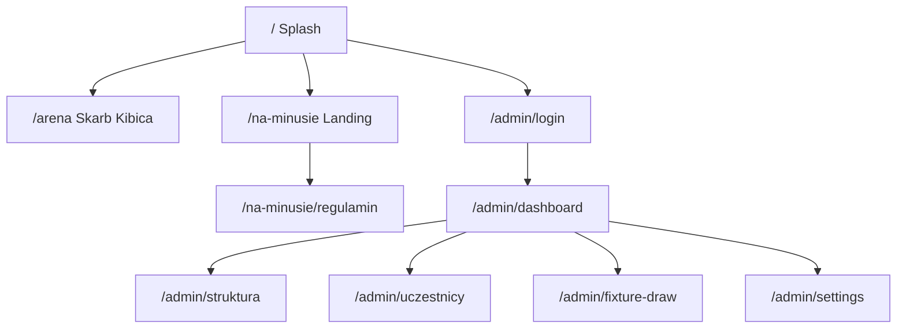

# Na Minusie ™ — Kompletna dokumentacja techniczna

> **Wersja dokumentu:** 1.0  
> **Data:** 30 lipca 2026  
> **Zakres:** wszystko zbudowane do tej pory w ramach platformy **Na Minusie ™** (landing + panel admina + Supabase + ceremonia losowania + logo + integracja z monorepo FPL Arena)  
> **Repozytorium:** `fpl-arena-skarb-kibica`

---

## Spis treści

1. [Wizja produktu i kontekst](#1-wizja-produktu-i-kontekst)
2. [Architektura platformy (monorepo)](#2-architektura-platformy-monorepo)
3. [Stos technologiczny](#3-stos-technologiczny)
4. [Środowisko, konfiguracja i uruchomienie](#4-środowisko-konfiguracja-i-uruchomienie)
5. [Routing i mapa URL](#5-routing-i-mapa-url)
6. [Warstwa wizualna i branding](#6-warstwa-wizualna-i-branding)
7. [Landing publiczny `/na-minusie`](#7-landing-publiczny-na-minusie)
8. [Supabase — baza, auth, RLS](#8-supabase--baza-auth-rls)
9. [Panel administratora — przegląd IA](#9-panel-administratora--przegląd-ia)
10. [Autentykacja i ochrona tras](#10-autentykacja-i-ochrona-tras)
11. [Struktura Ligi](#11-struktura-ligi)
12. [Uczestnicy](#12-uczestnicy)
13. [Import CSV (Dry-Run)](#13-import-csv-dry-run)
14. [Logo klubów](#14-logo-klubów)
15. [Maszyna Losująca (Berger + ceremonia)](#15-maszyna-losująca-berger--ceremonia)
16. [Danger Zone](#16-danger-zone)
17. [Server Actions — katalog API](#17-server-actions--katalog-api)
18. [Komponenty UI — katalog](#18-komponenty-ui--katalog)
19. [Model danych (TypeScript)](#19-model-danych-typescript)
20. [Workflow operacyjny sezonu](#20-workflow-operacyjny-sezonu)
21. [Znane ograniczenia i dług techniczny](#21-znane-ograniczenia-i-dług-techniczny)
22. [Roadmapa (jeszcze niezaimplementowane)](#22-roadmapa-jeszcze-niezaimplementowane)
23. [Mapa plików (szybki indeks)](#23-mapa-plików-szybki-indeks)
24. [Słownik pojęć](#24-słownik-pojęć)

---

## 1. Wizja produktu i kontekst

**Na Minusie ™** to nowa liga Fantasy Premier League w formacie **H2H** (head-to-head), budowana obok istniejącego archiwum **FPL Arena (Skarb Kibica)**.

### Cele biznesowo-produktowe (zrealizowane częściowo)

| Cel | Status |
|-----|--------|
| Publiczny landing rekrutacyjny z regulaminem | ✅ |
| Portal wyboru Arena vs Na Minusie na `/` | ✅ |
| Panel CMS do zarządzania strukturą ligi | ✅ |
| Import i zarządzanie uczestnikami | ✅ |
| Logo klubów (crest) w UI | ✅ |
| Losowanie terminarza (Berger) z ceremonią | ✅ |
| Publiczny hub sezonów PUBLISHED | ❌ (plan) |
| Wklejanie wyników GW + Mediana 2+1 | ❌ (plan, stub `/admin/gw-results`) |
| Puchary stylu CL (Anglia B) | ❌ (plan) |

### Reguła produktowa (docelowa, nie w pełni w silniku wyników)

Silnik punktacji H2H w dokumentacji produktowej opiera się o **Mediana 2+1** (punkty FPL + bonus mediany). W schemacie `fixtures` są już kolumny pod wyniki i bonusy; **UI wyników GW nie jest jeszcze zaimplementowane**.

---

## 2. Architektura platformy (monorepo)

Projekt jest **jednym repozytorium** z dwoma „światami”:

```
┌─────────────────────────────────────────────────────────────┐
│                    Next.js 14 (App Router)                   │
│  /  splash  ·  /arena  ·  /na-minusie  ·  /admin/*          │
├──────────────────────────┬──────────────────────────────────┤
│ Legacy Vite SPA (src/)   │  Na Minusie (app/ + components/) │
│ montowane przez @arena   │  Landing + Admin + Supabase      │
└──────────────────────────┴──────────────────────────────────┘
```

### Zasady podziału

1. **Next.js jest głównym entrypointem** (`npm run dev` → `next dev`).
2. **FPL Arena** żyje w `src/` i jest mountowana w `/arena` przez alias webpack `@arena` → `src`.
3. **Na Minusie** to nowe ścieżki App Router + `components/na-minusie` + `components/admin` + `lib/admin` + `lib/supabase`.
4. TypeScript Nexta **wyklucza** `src/` z kompilacji (`tsconfig.json` `exclude`), a `next.config.mjs` ma `typescript.ignoreBuildErrors: true`, żeby legacy nie blokował buildów Next.

### Diagram przepływu użytkownika



---

## 3. Stos technologiczny

| Warstwa | Technologia | Wersja (package.json) | Rola |
|---------|-------------|------------------------|------|
| Framework | Next.js (App Router) | ^14.2.35 | Routing, SSR/RSC, Server Actions |
| UI | React | ^18.3.1 | Komponenty klient/serwer |
| Język | TypeScript | ~5.7 | Typy w `app/`, `components/`, `lib/` |
| Style | Tailwind CSS | ^3.4.17 | Utility-first + `globals.css` / `admin.css` / `na-minusie.css` |
| PostCSS | postcss + autoprefixer | 8.x / 10.x | Pipeline CSS |
| Auth + DB | Supabase JS + SSR | supabase-js ^2.111, @supabase/ssr ^0.12 | Auth cookies, Postgres |
| CSV | Papa Parse | ^5.5.4 | Dry-run importu uczestników |
| Ikony | lucide-react | ^1.27 | Sidebar, ceremonie, CTA |
| Fonty | Inter + Oswald (Google Fonts) | link w `app/layout.tsx` | UI + athletic headings |
| Legacy bundler | Vite | ^6 | Tylko Arena (`dev:arena` / `build:arena`) |
| Export kart | html-to-image | ^1.11 | Legacy Arena (centrum kart) |

### Skrypty npm (istotne)

| Skrypt | Działanie |
|--------|-----------|
| `npm run dev` | `predev` (sync public) + `next dev` |
| `npm run build` / `start` | Build / produkcja Next |
| `npm run typecheck` | `tsc --noEmit` |
| `npm run dev:arena` | Vite SPA Arena |
| `npm run build:arena` | Build Vite + weryfikacja dist |

### Alias ścieżek

```ts
// tsconfig.json / next.config.mjs
"@/*"      → "./*"
"@arena/*" → "./src/*"
```

---

## 4. Środowisko, konfiguracja i uruchomienie

### Zmienne środowiskowe (`.env.example` → `.env.local`)

| Zmienna | Opis |
|---------|------|
| `PORT` | Port Node (domyślnie 3000) |
| `NEXT_PUBLIC_SUPABASE_URL` | Project URL Supabase (bez trailing slash — strip w `lib/supabase/env.ts`) |
| `NEXT_PUBLIC_SUPABASE_ANON_KEY` | Klucz **anon / publishable** (NIGDY `service_role` w `NEXT_PUBLIC_`) |

Plik `.env.local` jest gitignored.

### `next.config.mjs` — kluczowe decyzje

- `reactStrictMode: true`
- `experimental.serverActions.bodySizeLimit: "4mb"` — upload logo
- `typescript.ignoreBuildErrors: true` — legacy `src/`
- **Webpack cache wyłączony w `dev`** — ścieżka OneDrive + znaki specjalne (`-=NOWY START=-`) psuły PackFileCache → 404 na chunki CSS/JS
- Alias `@arena` → `src`

### Lokalne uruchomienie admina

```bash
# 1. Skopiuj env
cp .env.example .env.local   # uzupełnij URL + anon key

# 2. W Supabase SQL Editor wklej CAŁOŚĆ supabase/schema.sql (przy pierwszej instalacji / migracji V2)

# 3. Tylko JEDEN proces next dev (wiele instancji → 404 na /_next/static)
npm run dev

# 4. http://localhost:3000/admin/login
```

### Uwagi operacyjne (Windows / OneDrive)

- Unikać równoległych `npm run dev` w terminalu IDE i agentcie.
- Po kasowaniu `.next` → twarde odświeżenie przeglądarki (`Ctrl+Shift+R`).
- Objaw zepsutego cache: HTML OK, ale CSS/JS 404 → panel „bez stylów”, przyciski „martwe”.

---

## 5. Routing i mapa URL

### Publiczne

| URL | Plik | Opis |
|-----|------|------|
| `/` | `app/page.tsx` | Splash — wybór Arena / Na Minusie |
| `/arena` | `app/arena/page.tsx` | Legacy Skarb Kibica |
| `/na-minusie` | `app/na-minusie/page.tsx` | Landing rekrutacyjny |
| `/na-minusie/regulamin` | `app/na-minusie/regulamin/page.tsx` | Regulamin (osobna strona) |

### Admin

| URL | Plik | Dostęp |
|-----|------|--------|
| `/admin` | redirect middleware | → dashboard lub login |
| `/admin/login` | `app/admin/login/page.tsx` | publiczne |
| `/admin/dashboard` | `(panel)/dashboard/page.tsx` | sesja |
| `/admin/struktura` | `(panel)/struktura/page.tsx` | sesja |
| `/admin/uczestnicy` | `(panel)/uczestnicy/page.tsx` | sesja |
| `/admin/uczestnicy?tab=import\|logo\|dodaj` | ten sam hub | sesja |
| `/admin/fixture-draw` | `(panel)/fixture-draw/page.tsx` | sesja |
| `/admin/settings` | `(panel)/settings/page.tsx` | Danger Zone |
| `/admin/gw-results` | stub `AdminPlaceholder` | **nie w menu** |

### Redirecty legacy (kompatybilność starych bookmarków)

| Stary URL | Nowy |
|-----------|------|
| `/admin/seasons` | `/admin/struktura` |
| `/admin/divisions` | `/admin/struktura#dywizje` |
| `/admin/teams` | `/admin/uczestnicy` |
| `/admin/club-logos` | `/admin/uczestnicy?tab=logo` |

### Middleware

- Plik: **`middleware.ts` (root)** — matcher `["/admin/:path*"]`
- Odświeża sesję Supabase (cookies), chroni `/admin/*` poza loginem
- Zalogowany na `/admin/login` → `/admin/dashboard`

---

## 6. Warstwa wizualna i branding

### Palety

#### Landing Na Minusie (`app/na-minusie/na-minusie.css`)

- Ciemne tło platformy, akcent **zielony / athletic**
- Sekcje: hero, dlaczego, mediana, struktura, dołącz
- Fonty: Inter (body), Oswald (`font-athletic`)

#### Panel admina (`app/admin/admin.css` + Tailwind)

| Token CSS | Wartość | Użycie |
|-----------|---------|--------|
| `--admin-bg` | `#050505` | tło |
| `--admin-surface` | `#111111` | karty |
| `--admin-border` | `#1a1a1a` | obramowania |
| `--admin-green` | `#39ff14` | CTA, focus, sukces |
| `--admin-muted` | `#888888` | tekst drugorzędny |

Akcent UI w klasach Tailwind: `#39FF14`, tła `slate-800/50`, `slate-900`, border `slate-700/50`.

### Animacje ceremonii losowania

| Klasa | Efekt |
|-------|-------|
| `.nm-draw-fade` | wejście pary GW1 (fade + translate + scale) |
| `.nm-draw-slot-pop` | „wystrzał” pozycji startowej |
| `.nm-draw-vs-pulse` | puls VS przy aktywnym meczu |
| `.nm-draw-locked` | shimmer na zablokowanych slotach (gdy używane) |

### Hierarchia wyświetlania klubu (wszędzie w adminie)

1. **Logo / crest** (jeśli jest w bibliotece)
2. **Nazwa klubu** — `chosen_club` / Discord Club, **UPPERCASE**, bold
3. **Meta** — `(manager_name · discord_nick)` mniejszym, muted

### Logo w terminarzu (układ względem VS)

```
[ NAZWA KLUBU ] [ LOGO ]  | VS |  [ LOGO ] [ NAZWA KLUBU ]
        meta                         meta
```

Logo jest **bliżej VS** po obu stronach; crest bez czarnego tła kontenera (PNG transparency).

### Skala crestów (`lib/admin/clubLogos.ts` → `CLUB_LOGO_SIZES`)

| Token | px | Typowe miejsce |
|-------|-----|----------------|
| `xs` | 36 | gęste listy / CSV |
| `sm` | 44 | tabele |
| `md` | 56 | listy uczestników, sloty |
| `lg` | 64 | terminarz / VS |
| `xl` | 72 | formularz, highlight ceremonii |
| `hero` | 112 | biblioteka logo |

Kafelki terminarza / list mają **minimalny padding pionowy** (`py-1` / `py-1.5`), żeby crest prawie stykał się z krawędziami kafelka.

Master upload: kwadrat **~400×400**, PNG z przezroczystością, max **2 MB**.

---

## 7. Landing publiczny `/na-minusie`

### Struktura komponentów (`components/na-minusie/`)

| Komponent | Rola |
|-----------|------|
| `StickyNavbar` | sticky nav + smooth scroll do sekcji |
| `HeroSection` | hero brand-first |
| `WhySection` | `#dlaczego` |
| `MedianSection` | `#mediana` — wyjaśnienie Mediana 2+1 |
| `StructureSection` | `#struktura` — piramida ligi |
| `JoinSection` | `#dolacz` — CTA Discord / formularz |
| `CtaButtons` | grupy CTA |
| `SectionShell` | wspólny wrapper sekcji (`tight` spacing) |

### Regulamin

- Osobna trasa `/na-minusie/regulamin` (nie inline na landingu)
- Link z nawigacji + przycisk secondary CTA

### Linki zewnętrzne

Konfiguracja: `lib/na-minusie/links.ts` (Discord, Google Forms itp.).

---

## 8. Supabase — baza, auth, RLS

### Instalacja schematu

Plik: **`supabase/schema.sql`** (Schema V2).

> **UWAGA:** skrypt zaczyna od `DROP TABLE … CASCADE` dla piramid/sezonów/dywizji/drużyn/fixtures. Przy wdrażaniu na środowisku z danymi — backup lub migracja przyrostowa.

Uruchomienie: Supabase Dashboard → **SQL Editor** → wklej całość → Run.

### Tabele

#### `admin_users`

| Kolumna | Typ | Opis |
|---------|-----|------|
| `user_id` | UUID PK → `auth.users` | powiązanie z Auth |
| `created_at` | timestamptz | |

Obecnie **aplikacja nie sprawdza** membership w `admin_users` — dostęp do panelu ma **każdy zalogowany użytkownik Auth**.

#### `pyramids`

Regiony / „ligi nadrzędne” (np. Anglia A, Anglia B).

| Kolumna | Constraints |
|---------|-------------|
| `id` | UUID PK |
| `name` | TEXT UNIQUE NOT NULL |
| `created_at` | timestamptz |

#### `seasons`

| Kolumna | Constraints |
|---------|-------------|
| `id` | UUID PK |
| `name` | TEXT |
| `status` | `DRAFT` \| `PUBLISHED` (default `DRAFT`) |
| `created_at` | timestamptz |

#### `divisions`

Powiązanie **sezon × piramida × tier**.

| Kolumna | Constraints |
|---------|-------------|
| `id` | UUID PK |
| `pyramid_id` | FK → pyramids CASCADE |
| `season_id` | FK → seasons CASCADE |
| `name` | TEXT |
| `tier` | INTEGER ≥ 1 |
| UNIQUE | `(season_id, pyramid_id, tier)` |

#### `teams` (uczestnicy)

| Kolumna | Opis |
|---------|------|
| `division_id` | FK → divisions |
| `manager_name` | menedżer FPL |
| `discord_nick` | nick Discord |
| `fpl_id` | ID entry FPL (klucz upsert CSV) |
| `fpl_team_name` | nazwa drużyny FPL |
| `chosen_club` | **Discord Club** — nazwa klubu (klucz logo) |
| `fee_paid` | boolean wpisowe |

#### `fixtures`

| Kolumna | Opis |
|---------|------|
| `season_id`, `division_id` | kontekst |
| `gameweek` | 1–38 |
| `home_team_id`, `away_team_id` | FK teams, różne |
| `home_fpl_points`, `away_fpl_points` | nullable — pod wyniki |
| `home_h2h_points`, `away_h2h_points` | 0 \| 1 \| 2 |
| `home_median_bonus`, `away_median_bonus` | 0 \| 1 |
| `is_finished` | boolean |
| UNIQUE | `(season_id, division_id, gameweek, home, away)` |

### RLS (skrót)

- **anon:** SELECT na pyramids, seasons, divisions, teams, fixtures (pod przyszły hub publiczny)
- **authenticated:** SELECT + INSERT/UPDATE/DELETE (ALL) na tych tabelach + `admin_users`

### Klienci (`lib/supabase/`)

| Plik | Użycie |
|------|--------|
| `env.ts` | odczyt URL/key, trim trailing `/` |
| `client.ts` | browser (`createBrowserClient`) — login |
| `server.ts` | cookies (`createServerClient`) — Server Actions, RSC |
| `middleware.ts` | helper `updateSession` (logika też inline w root `middleware.ts`) |

---

## 9. Panel administratora — przegląd IA

### Menu (`lib/admin/navigation.ts`)

1. **Dashboard** — `LayoutDashboard`
2. **Struktura Ligi** — `Network` → `/admin/struktura`
3. **Uczestnicy** — `Users` → `/admin/uczestnicy`
4. **Maszyna Losująca** — `Shuffle` → `/admin/fixture-draw`
5. **Danger Zone** — `ShieldAlert` → `/admin/settings`

Brand sidebar: **`Na Minusie ™ Admin`**.

### Layouty

- `app/admin/layout.tsx` — ładuje `admin.css`, wrapper `.admin-theme`
- `app/admin/(panel)/layout.tsx` — wymaga usera, `AdminSidebar` + content

### Dashboard

- Liczniki: piramidy / sezony / dywizje / uczestnicy
- Skróty do Struktury, Uczestników, Maszyny
- Checklist workflow setupu sezonu

---

## 10. Autentykacja i ochrona tras

### Login (preferowany flow)

1. UI: `components/admin/LoginForm.tsx` (client)
2. `createClient()` z `lib/supabase/client.ts`
3. `signInWithPassword({ email, password })`
4. `router.push("/admin/dashboard")` (+ refresh)

**Dlaczego client, nie SSR:** wcześniej server-side fetch do Supabase Auth potrafił zawodzić w lokalnym środowisku; przeglądarkowy klient jest stabilniejszy.

### Fallback server action

`app/admin/login/actions.ts` → `loginAction` (FormData email/password).

### Logout

`app/admin/actions.ts` → `logoutAction` → `signOut` → redirect `/admin/login`.

### Sesja po restarcie Nexta

Sesja siedzi w **ciasteczkach przeglądarki**. Restart `npm run dev` **nie wylogowuje**. Wylogowanie tylko przez **Wyloguj**.

### Model uprawnień (aktualny)

| Warstwa | Zachowanie |
|---------|------------|
| Middleware / layout | wymaga sesji Auth |
| `admin_users` | tabela istnieje, **nie jest używana w checkach** |
| RLS write | dowolny `authenticated` |

Docelowo: zawęzić write do użytkowników z `admin_users` (funkcja `is_admin()` była dropnięta w schema V2 i nie odtworzona).

---

## 11. Struktura Ligi

**URL:** `/admin/struktura`  
**Cel:** komplet architektury w jednym hubie.

### Bloki UI

| Sekcja | Komponent | Operacje |
|--------|-----------|----------|
| Piramidy | `PyramidSection` | create / delete |
| Sezony | `SeasonSection` | create / toggle DRAFT↔PUBLISHED / delete |
| Dywizje | `DivisionManager` (`#dywizje`) | create (sezon+piramida+tier+nazwa) / delete |

### Server Actions (db.ts)

- `getPyramids`, `createPyramid`, `deletePyramid`
- `getSeasons`, `createSeason`, `updateSeasonStatus`, `deleteSeason`
- `getDivisions`, `createDivision`, `deleteDivision`
- `getDivisionsForSeasonPyramid(seasonId, pyramidId)` — bez zagnieżdżonych joinów PostgREST (uniknięcie PGRST200)

### Semantyka statusu sezonu

- **DRAFT (Szkic)** — praca admina, setup
- **PUBLISHED** — docelowo widoczność publiczna (hub jeszcze nie zbudowany)

### Relacja danych

```
Pyramid ──┐
          ├── Division (tier, name) ── Team[]
Season  ──┘                         └── Fixture[]
```

---

## 12. Uczestnicy

**URL:** `/admin/uczestnicy`  
**Hub:** `components/admin/UczestnicyHub.tsx` (client tabs + `useSearchParams`)

### Zakładki

| Tab | `?tab=` | Zawartość |
|-----|---------|-----------|
| Zarządzaj | *(domyślna / brak)* | `TeamsByDivision` — lista, edycja, usuwanie |
| Import CSV | `import` | `CsvImport` |
| Logo klubów | `logo` | `ClubLogoManager` |
| Dodaj ręcznie | `dodaj` | `TeamForm` |

### Zarządzanie listą (`TeamsByDivision`)

- Grupowanie po dywizjach z etykietą: **Sezon · Piramida · Tier · nazwa**
- Kolumny: menedżer, Discord, FPL ID, klub (+ logo), wpisowe, akcje
- **Edycja (modal):** wszystkie pola + `ClubField` (podgląd logo + lista biblioteki) + select dywizji z pełnym kontekstem sezon/piramida/tier
- **Usuwanie:** confirm → `deleteTeam`
- Po zapisie: `revalidatePath` na layout admina / uczestników / fixture-draw

### Dodawanie ręczne (`TeamForm`)

Pola: manager, discord, FPL ID, nazwa FPL, **klub** (`ClubField`), dywizja, fee_paid.  
`createTeam` przez `useFormState`.

### Aktualizacja

`updateTeam` — Server Action z FormData (`id` + pola jak przy create).

---

## 13. Import CSV (Dry-Run)

**Komponent:** `components/admin/CsvImport.tsx`  
**Biblioteka:** Papa Parse (client-side parse)

### Wymagane nagłówki (dokładne nazwy)

| Nagłówek CSV | Mapowanie |
|-------------|-----------|
| `Dywizja` | tier (liczba) → `division_id` |
| `FPL Team` | `fpl_team_name` |
| `FPL Manager` | `manager_name` |
| `FPL ID` | `fpl_id` (klucz UPSERT) |
| `Discord Name` | `discord_nick` |
| `Discord Club` | `chosen_club` (**także klucz logo**) |
| `Wpłacono` | `fee_paid` — `true` jeśli wartość **zawiera** `"10"` |

### Krok 1 — Dry-Run (client)

1. Wybór **sezonu** i **piramidy**
2. Upload / drop CSV
3. Parse z `header: true`, skip empty, strip BOM z nagłówków
4. Wiersze bez numerycznej `Dywizja` → pomijane (notatki Excela)
5. Walidacja: FPL ID (wymagane + tylko cyfry), Discord Club, FPL Manager
6. Podział na **Gotowe** / **Błędy** z podglądem tabeli (+ logo jeśli znane)

### Krok 2 — Commit

`bulkUpsertTeams(rows, seasonId, pyramidId)`:

1. Pobiera dywizje dla sezon×piramida
2. Mapuje `tier` → `division_id` (brak mapowania = błąd wiersza)
3. Istniejące drużyny w tych dywizjach → match po `fpl_id`
4. **Insert** nowych / **Update** istniejących (division, nazwy, club, fee)
5. Revalidate ścieżek admina

---

## 14. Logo klubów

### Przechowywanie (filesystem, nie Storage Supabase)

```
public/club-logos/
  index.json          # manifest
  chelsea.png
  west-ham.png
  arsenal.png
  …
```

**Dlaczego folder, nie tylko DB:** pliki serwowane statycznie jako `/club-logos/{file}`, łatwy podgląd, zgodne z wymaganiem „po przypisaniu w odpowiednim folderze”.

### Manifest (`index.json`)

```json
{
  "version": 1,
  "logos": [
    {
      "clubKey": "chelsea",
      "clubName": "Chelsea",
      "fileName": "chelsea.png",
      "updatedAt": "ISO-8601"
    }
  ]
}
```

### Server Actions (`app/admin/actions/clubLogos.ts`)

| Funkcja | Opis |
|---------|------|
| `listClubLogos` | odczyt index |
| `upsertClubLogo` | upload FormData → zapis pliku + index |
| `deleteClubLogo` | unlink + usunięcie z index |
| `renameClubLogo` | zmiana nazwy/klucza + rename pliku |
| `resolveClubLogoUrl` / `getClubLogoMap` | helpers |

Slug: `slugifyClubName("West Ham")` → `west-ham`.

### UI managera (`ClubLogoManager`)

- **Lista klubów** = unikalne `chosen_club` z uczestników (+ istniejące logo)
- Wybór klubu z `<select>`, nie wolny tekst (główny flow)
- Upload z **podglądem** (Object URL) + komunikat „Wczytano: plik · KB”
- Biblioteka: podgląd hero, zamiana pliku, rename, delete

### Resolucja w UI

`findClubLogo(logos, chosen_club)` → match po `clubKey` / nazwie / slug nazwy.  
Brak pliku → okrągły placeholder z inicjałem (bez czarnego fill na crestach z plikiem).

### Spójność

Nazwa w bibliotece **musi odpowiadać** `chosen_club` uczestnika (Discord Club z CSV). Po `revalidatePath` logo pojawia się w:

- liście Uczestników
- podglądzie CSV
- slotach losowania
- terminarzu GW

---

## 15. Maszyna Losująca (Berger + ceremonia)

**URL:** `/admin/fixture-draw`  
**UI:** `FixtureDrawMachine`  
**Algorytm:** `lib/admin/berger.ts`  
**Persystencja:** `app/admin/actions/fixtures.ts`

### Algorytm Bergera (circle method)

- Wejście: tablica `teamIds` (po shuffle)
- Nieparzysta liczba → wirtualny `BYE` (mecze z BYE pomijane)
- Pierwsza połowa: `N-1` kolejek „każdy z każdym”
- Druga połowa: rewanże (zamiana home/away), GW przesunięte o `N-1`
- Dla **10 drużyn** → **18 gameweeków**, 5 meczów na GW

Funkcje: `shuffleInPlace`, `generateBergerFixtures`.

### Generowanie w bazie — `generateDivisionFixtures(seasonId, divisionId, force?)`

1. Auth required
2. Walidacja dywizji należy do sezonu
3. Pobranie drużyn dywizji (≥2)
4. Jeśli fixtures istnieją i `force=false` → błąd „już istnieje” (UI proponuje redraw)
5. `force=true` → delete fixtures dywizji
6. Shuffle kolejności = **pozycje startowe**
7. Berger → insert do `fixtures` (wyniki zerowe)
8. Zwrot: `drawOrder: Team[]`, `fixtures: FixtureRow[]` (z joinami home/away) do ceremonii

### Ceremonia UI — fazy

`DrawPhase = "idle" | "drawing-slots" | "revealing-gw1" | "done"`

| Etap | Timing (orientacyjnie) | UI |
|------|------------------------|-----|
| Intro tasowanie | 1600 ms | status line |
| Każda pozycja #1…#N | 900 ms suspense + 1750 ms hold | `TeamCard` + slot-pop |
| Pauza przed GW1 | 2800 ms | komunikat |
| Drumroll GW1 | 1800 ms | przejście fazy |
| Każdy mecz GW1 | 2200 ms | fade-in przy VS |
| Domknięcie GW2+ | 1200 ms | pełny terminarz z tabami GW |

### Kontrola terminarza

- Podgląd po GW (1…18)
- **Usuń terminarz** → `deleteDivisionFixtures`
- **Wylosuj ponownie** → confirm + `force=true`
- Ostrzeżenie gdy liczba drużyn ≠ 10 (regulamin), ale draw możliwy od 2 zespołów

### Selectory kontekstu

`Sezon → Piramida → Dywizja` (dywizje ładowane live przez `getDivisionsForSeasonPyramid`).

---

## 16. Danger Zone

**URL:** `/admin/settings`  
**Komponent:** `DangerZonePanel`  
**Akcja:** `wipeLeagueData` / `wipeLeagueDataForm`

### Zabezpieczenia UX

1. Pole tekstowe — po normalizacji (tylko A–Z) musi być **`POTWIERDZAM`**
2. Checkbox „rozumiem nieodwracalność”
3. Formularz Server Action (`useFormState`) — działa nawet przy problemach hydracji lepiej niż sam `onClick` + `window.confirm`

### Co jest kasowane (kolejność FK-safe)

1. `fixtures`
2. `teams`
3. `divisions`
4. `seasons`
5. `pyramids`

Delete: `.gte("created_at", "1970-01-01")` (obejście braku „delete all” bez filtra w PostgREST).

### Czego NIE kasuje

- Konta **Supabase Auth**
- Wiersze `admin_users`
- Pliki w `public/club-logos/` (biblioteka crestów zostaje)

---

## 17. Server Actions — katalog API

Wszystkie mutacje admina idą przez `"use server"`.

### `app/admin/actions/db.ts`

CRUD piramid, sezonów, dywizji, drużyn, bulk CSV, wipe.  
Wspólne: `requireAuth()`, `revalidateAdmin()` → ścieżki `/admin`, struktura, uczestnicy, fixture-draw, dashboard.

### `app/admin/actions/fixtures.ts`

Odczyt drużyn/fixtures dywizji, count, delete, generate (+ payload ceremonii).

### `app/admin/actions/clubLogos.ts`

Filesystem CRUD logo + revalidate.

### Auth actions

- `app/admin/actions.ts` — logout  
- `app/admin/login/actions.ts` — login (fallback)

---

## 18. Komponenty UI — katalog

### Admin (`components/admin/`)

| Komponent | Rola |
|-----------|------|
| `AdminSidebar` | nawigacja |
| `LogoutButton` | wylogowanie |
| `LoginForm` | logowanie |
| `SubmitButton` | submit + pending (`useFormStatus`) |
| `PyramidSection` / `SeasonSection` / `DivisionManager` | struktura |
| `UczestnicyHub` | zakładki uczestników |
| `TeamsByDivision` | lista + modal edycji |
| `TeamForm` | dodanie ręczne |
| `CsvImport` | dry-run + commit |
| `ClubLogo` | crest / placeholder |
| `ClubNameWithLogo` | klub+logo względem VS |
| `ClubField` | pole klubu z podglądem |
| `ClubLogoManager` | CRUD logo |
| `FixtureDrawMachine` | cała maszyna losująca |
| `DangerZonePanel` | wipe |
| `AdminPlaceholder` | stub (gw-results) |

### Platform / Na Minusie (public)

`components/platform/*`, `components/na-minusie/*`, `components/arena/*` — splash, landing, mount Areny.

---

## 19. Model danych (TypeScript)

Plik: `lib/admin/types.ts`

```ts
type SeasonStatus = "DRAFT" | "PUBLISHED";

interface Pyramid { id; name; created_at }
interface Season { id; name; status; created_at }
interface Division {
  id; pyramid_id; season_id; name; tier; created_at;
  // opcjonalne embedy (gdy join działa)
  pyramids?; seasons?;
}
interface Team {
  id; division_id; manager_name; discord_nick;
  fpl_id; fpl_team_name; chosen_club; fee_paid; created_at;
  divisions?;
}
interface ActionState { error: string | null; success?: string | null }
```

`FixtureRow` zdefiniowany w `app/admin/actions/fixtures.ts` (z opcjonalnym `home_team` / `away_team`).

Logo: `ClubLogoRecord` w `lib/admin/clubLogos.ts`.

---

## 20. Workflow operacyjny sezonu

1. **Supabase:** uruchom `schema.sql` (środowisko czyste / po uzgodnieniu dropów).
2. **Auth:** utwórz użytkownika w Supabase Auth; zaloguj w `/admin/login`.
3. **Struktura Ligi:**
   - dodaj piramidę (np. Anglia A),
   - dodaj sezon (startuje jako Szkic),
   - dodaj dywizje (tier 1…N) dla sezon×piramida.
4. **Uczestnicy:**
   - Import CSV (dry-run → potwierdź) **lub** dodaj ręcznie,
   - zakładka Logo — przypisz crest do Discord Club,
   - edytuj / przenieś między dywizjami w razie potrzeby.
5. **Maszyna Losująca:** wybierz sezon → piramidę → dywizję → ceremonię → terminarz.
6. **Publikacja:** przełącz sezon na `PUBLISHED` (publiczny hub — przyszła faza).
7. **Wyniki GW / Mediana:** jeszcze nie — stub `gw-results`.

---

## 21. Znane ograniczenia i dług techniczny

| Temat | Opis |
|-------|------|
| Authz | Brak egzekwowania `admin_users` / `is_admin()` |
| Logo storage | Tylko lokalny `public/` — na Vercel ephemeral FS; docelowo Supabase Storage |
| OneDrive path | Specjalne znaki w ścieżce → wyłączony webpack cache w dev |
| Multi `next dev` | Powoduje 404 chunków i „martwy” UI |
| Nested PostgREST | Unikamy `select('*, seasons(...)')` gdy brak pewności FK w cache → PGRST200 |
| `/admin/gw-results` | Placeholder, poza nawigacją |
| Dokumentacja starsza | `docs/architecture.md` / `project_overview.md` nie pokrywały panelu admina — ten dokument uzupełnia lukę |
| Wipe vs logo | Wipe nie czyści `public/club-logos/` |

---

## 22. Roadmapa (jeszcze niezaimplementowane)

Z planu master (akceptowanego produktowo):

1. **Publiczny hub** sezonów `PUBLISHED` (tabele, terminarz, logo).
2. **Wklejanie / import wyników GW** + silnik **Mediana 2+1** (wykorzystanie kolumn w `fixtures`).
3. **Rozszerzenie crestów** / CDN / Storage.
4. **Puchary Anglia B** (format CL-like).
5. **Backup / eksport** przed wipe.
6. Twarde **RBAC** na `admin_users`.

---

## 23. Mapa plików (szybki indeks)

```
app/
  layout.tsx, page.tsx, globals.css
  na-minusie/…
  arena/…
  admin/
    layout.tsx, admin.css
    login/…
    (panel)/
      layout.tsx
      dashboard/, struktura/, uczestnicy/, fixture-draw/, settings/
      seasons|divisions|teams|club-logos/  → redirecty
    actions/ db.ts, fixtures.ts, clubLogos.ts
middleware.ts
components/admin/…
components/na-minusie/…
lib/admin/ types.ts, navigation.ts, berger.ts, clubLogos.ts
lib/supabase/ …
supabase/schema.sql
public/club-logos/ …
docs/
  NA_MINUSIE_TECHNICAL.md   ← TEN DOKUMENT
  architecture.md, project_overview.md, TECHNICAL.md (Arena legacy)
```

---

## 24. Słownik pojęć

| Termin | Znaczenie |
|--------|-----------|
| **Piramida** | Region / gałąź ligi (np. Anglia A) |
| **Sezon** | Edycja czasowa ze statusem Szkic/Publikacja |
| **Dywizja** | Tier w ramach sezon×piramida |
| **Uczestnik / drużyna** | Rekord `teams` — menedżer FPL + Discord Club |
| **chosen_club** | Nazwa klubu PL (z CSV: Discord Club) |
| **Berger** | Algorytm terminarza każdy-z-każdym + rewanże |
| **Dry-Run** | Podgląd walidacji CSV bez zapisu |
| **UPSERT** | Insert lub update po `fpl_id` |
| **Mediana 2+1** | Docelowa punktacja H2H (jeszcze bez UI wyników) |
| **Ceremonia** | Animowane losowanie pozycji + odsłanianie GW1 |

---

## Aneks A — Checklist akceptacji funkcji (stan bieżący)

- [x] Splash `/` Arena vs Na Minusie  
- [x] Landing + regulamin  
- [x] Login / logout / middleware  
- [x] Struktura: piramidy, sezony, dywizje  
- [x] Uczestnicy: CRUD, CSV, logo  
- [x] Cresty w listach i terminarzu (rozmiar, brak fill, układ przy VS)  
- [x] Berger + ceremonia + podgląd GW  
- [x] Danger wipe z potwierdzeniem  
- [ ] Publiczne tabele / hub  
- [ ] Wyniki GW + Mediana  
- [ ] RBAC admin_users  

---

## Aneks B — Szybkie komendy diagnostyczne

```bash
# Czy działa tylko jeden listener :3000?
# (PowerShell)
Get-NetTCPConnection -LocalPort 3000 -State Listen

# Po problemach ze stylami:
# 1) zabij procesy next
# 2) usuń .next
# 3) npm run dev
# 4) Ctrl+Shift+R w przeglądarce
```

---

*Dokument wygenerowany na podstawie stanu kodu repozytorium `fpl-arena-skarb-kibica` z lipca 2026. Przy kolejnych fazach należy aktualizować sekcje 12–16, 21–22 oraz aneks A.*
