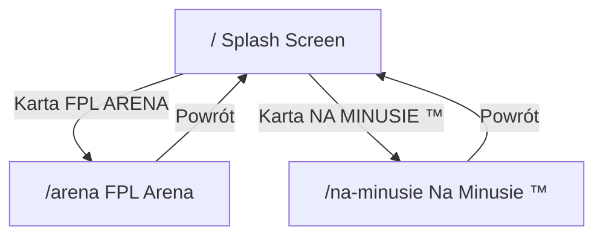

# Architektura platformy FPL

> Ostatnia aktualizacja: **Polish** — hermetyczny podział arena / na-minusie / platform, pełny redesign landing, logotypy z `logo/`.

## Stos technologiczny

| Warstwa | Technologia | Wersja |
|---------|-------------|--------|
| Framework | **Next.js** (App Router) | 14.x |
| UI | **React** | 18.x |
| Stylowanie | **Tailwind CSS** | 3.x |
| Ikony | **lucide-react** | 1.x |
| Język | **TypeScript** | 5.x |
| Fonty | Google Fonts (Inter + Oswald) via `<link>` | — |

### Legacy (FPL Arena)

Istniejąca aplikacja Vite + React w katalogu `src/` pozostaje nietknięta do czasu integracji w Fazie 2. Uruchomienie:

```bash
npm run dev:arena      # development
npm run build:arena    # produkcja
```

---

## Routing (App Router)

```
/                    → app/page.tsx          Splash screen — wybór portalu
/arena               → app/arena/page.tsx    Pełny Skarb Kibica (legacy `src/` via `@arena`)
/na-minusie          → app/na-minusie/page.tsx   Na Minusie ™ — landing page rekrutacyjny
```

### Diagram nawigacji



---

## Struktura folderów

```
fpl-arena-skarb-kibica/
├── app/
│   ├── layout.tsx, page.tsx, globals.css   # Splash + root
│   ├── arena/page.tsx                     # FPL Arena (legacy mount)
│   └── na-minusie/
│       ├── layout.tsx                     # Scoped theme (.nm-page)
│       ├── na-minusie.css                 # Paleta Na Minusie ™
│       └── page.tsx                       # Landing composition
├── components/
│   ├── platform/PortalCard.tsx            # Splash — kafle wyboru portalu
│   ├── arena/
│   │   ├── ArenaAppClient.tsx             # Mount @arena/app/App
│   │   └── ArenaHomeLink.tsx              # Przycisk powrotu na /
│   └── na-minusie/                        # Wyłącznie landing Na Minusie ™
│       ├── StickyNavbar.tsx               # Sticky nav + smooth scroll
│       ├── HeroSection.tsx
│       ├── WhySection.tsx                 # #dlaczego
│       ├── MedianSection.tsx              # #mediana
│       ├── StructureSection.tsx           # #struktura
│       ├── JoinSection.tsx                # #dolacz
│       ├── CtaButtons.tsx
│       └── SectionShell.tsx
├── lib/
│   ├── platform/site.ts                   # SITE_NAME, PortalVariant
│   ├── arena/branding.ts                  # ARENA_PORTAL_LOGO
│   └── na-minusie/
│       ├── links.ts                       # Discord + Google Forms
│       ├── branding.ts                    # NA_MINUSIE_BRAND, logo
│       ├── navigation.ts                  # Anchory navbara
│       ├── theme.ts                       # Tokeny wizualne, max-w-7xl
│       └── index.ts
├── logo/                                  # Źródło logotypów (git)
│   ├── FPL Arena.png
│   └── Na Minusie.png
├── public/
│   ├── images/                            # Sync → fpl-arena-logo.png, na-minusie-logo.png
│   └── logo/                              # Sync herby drużyn
├── src/                                   # Legacy FPL Arena (Vite, alias @arena)
└── scripts/sync-public.mjs
```

### Landing `/na-minusie` — sekcje

| Anchor | Komponent | Zawartość |
|--------|-----------|-----------|
| — | `HeroSection` | Nagłówek, badge, CTA |
| `#dlaczego` | `WhySection` | 6 kart korzyści + porównanie vs klasyczne H2H |
| `#mediana` | `MedianSection` | Mediana 2+1 + tabela przykładu |
| `#struktura` | `StructureSection` | Piramida lig, awans/spadek |
| `#dolacz` | `JoinSection` | Finałowy baner CTA |

Linki: `lib/na-minusie/links.ts` — Discord + oficjalny Google Forms.

### Integracja FPL Arena (`/arena`)

1. Alias webpack `@arena` → `src/`
2. `ArenaAppClient` montuje `@arena/app/App`
3. `ArenaHomeLink` — fixed przycisk „Powrót do Strony Startowej” → `/`
4. Style: `@arena/styles/global.css`
5. Sync danych: `predev` / `prebuild` → `sync-public.mjs`

### Logotypy splash screen

`sync-public.mjs` kopiuje:
- `logo/FPL Arena.png` → `public/images/fpl-arena-logo.png`
- `logo/Na Minusie.png` → `public/images/na-minusie-logo.png`

### Konwencje

| Folder | Przeznaczenie |
|--------|---------------|
| `app/` | Strony i layouty Next.js (routing oparty na plikach) |
| `components/` | Komponenty UI wielokrotnego użytku |
| `lib/` | Stałe, helpery, logika bez UI |
| `src/` | Legacy kod FPL Arena — migracja w Fazie 2 |

Alias importów: `@/*` → katalog główny projektu.

---

## Style globalne (`app/globals.css`)

- Tło: `#0B0F19` z radialnymi gradientami (fiolet + zieleń).
- Siatka dekoracyjna (`.splash-grid`) na ekranie powitalnym.
- Fonty: Inter (body), Oswald (nagłówki athletic — `.font-athletic`).
- Zmienne CSS: `--background`, `--foreground`, `--accent-arena`, `--accent-na-minusie`.

### Warianty wizualne kart portalu

| Wariant | Paleta | Efekt hover |
|---------|--------|-------------|
| `arena` | Fiolet + róż (fuchsia) | Glow `rgba(168,85,247,0.55)` |
| `na-minusie` | Neonowa zieleń FPL | Glow `rgba(34,197,94,0.5)` |

---

## Skrypty npm

| Komenda | Opis |
|---------|------|
| `npm run dev` | Next.js dev server (port 3000) |
| `npm run build` | Build produkcyjny Next.js |
| `npm run start` | Serwer produkcyjny Next.js |
| `npm run typecheck` | Sprawdzenie typów TypeScript |
| `npm run dev:arena` | Legacy Vite dev (FPL Arena) |
| `npm run build:arena` | Legacy Vite build |

---

## Decyzje architektoniczne

1. **Next.js jako główny entry point** — nowa platforma rośnie w `app/`, legacy pozostaje w `src/` do czasu integracji.
2. **Wspólny Tailwind** — jeden `tailwind.config.js` skanuje zarówno `app/` jak i `src/`.
3. **Osobne tsconfig** — główny `tsconfig.json` dla Next.js; `tsconfig.app.json` zachowany dla legacy Vite.
4. **Komponenty wydzielone** — każda sekcja landing page w osobnym pliku w `components/na-minusie/`.
5. **Współdzielone CTA** — `CtaButtons` używany w Hero i CtaSection; linki w `lib/na-minusie.ts`.

---

## Następne kroki (Faza 3)

- Model danych Na Minusie — dywizje, sezony, gracze.
- Podmiana placeholderów linków Discord i formularza w `lib/na-minusie.ts`.
- Integracja legacy FPL Arena pod `/arena` (rewrite lub statyczny eksport).
